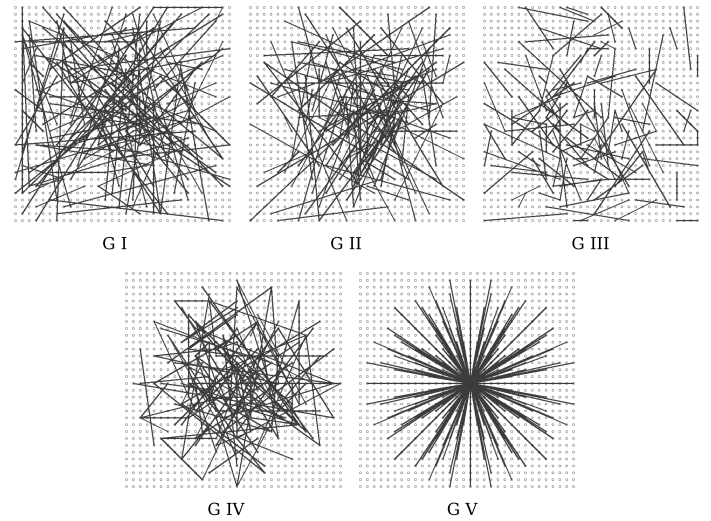
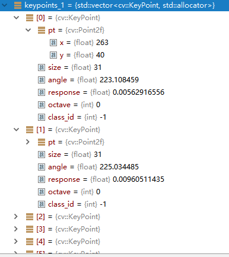

# ORB算法与源码解析

来自opencv

## 算法介绍

是ORB特征是将**FAST**特征点的检测方法与**BRIEF**特征描述子结合起来，并在它们原来的基础上做了改进与优化。

1.  利用**FAST**特征点检测的方法来检测特征点。
2.  利用**Harris**角点的度量方法，从**FAST**特征点从挑选出Harris角点响应值最大的$N$个特征点。
3.  解决局部不变性（尺度不变性和旋转不变性），即选择从不同高斯金字塔进行检测和对特征点添加角度特征。
4.  为特征点增加特征描述即描述子。


### FAST检测

**FAST**特征点的检测方式即寻找一个像素点周围半径为3中的角点，如图示：


### Harris评判

**Harris**方法是一种特征点评判方式。

其中**Harris**角点的响应函数定义为：


$$
R=det \boldsymbol{M} - \alpha(trace\boldsymbol{M})^2
$$

(其中 $det$指的是矩阵行列式的值；值得指的是矩阵的迹，即对角线元素之和；$M$指的是像素矩阵)

### 旋转不变性

尺度不变性的解决通过构建不同高斯金字塔（即对图像进行缩放）分别进行特征检测。而旋转不变性则是为每个特征点增加角度特征，角度的计算公式即：

$$
m_{pq} = \sum_{x,y}x^py^qI(x,y)
$$

$$
C = \left(\frac{m_{10}}{m_{00}},\frac{m_{01}}{m_{00}}\right)
$$

$$
\theta = arctan(m_{01},m_{10})
$$

其中$M_{pq}$的定义是在以特征点为中心的一个园内，对所有像素值（以灰度为单位）以x，y坐标为权进行的加权和。即算出像素的“重心”。从而可利用*公式(4)*来计算出特征点的方向。

### 描述子计算

描述子使用**BRIEF**方法来进行的特征描述方式，其原理即在特征点一定邻域内按照一定的股则选取一些点对，并对这些点对的灰度值进行比较，将结果的布尔值储存下来，最终结果为长度为128/256/512长度的比特串。

下图为一些点对的选择方法：

​	

（上图分别为：1. x,y方向平均分布采样 2. x,y均服从Gauss(0,S^2/25)各向同性采样 3. x服从Gauss(0,S^2/25)，y服从Gauss(0,S^2/100)采样 4. x,y从网格中随机获取 5. x一直在(0,0)，y从网格中随机选取）

为了解决旋转不变性，这里选择了**Steer BREIF**，即在计算描述值时考虑到旋转后的结果，其公式为：

$$
S_{\theta} = R_{\theta}S
$$

其中的$S$为选取的点对（$x_n$与$y_n$是一个点对两个点的灰度值），$R_{\theta}$为旋转不变性（公式（4））求得的旋转角度。
$$
S =\begin{pmatrix}x_1&x_2&\cdots&x_{2n} \\ y_1&y_2&\cdots&y_{2n}\end{pmatrix}
$$

$$
R_{\theta} = \begin{bmatrix}cos\theta & sin\theta \\ –sin\theta &cos\theta\end{bmatrix}
$$

### 匹配

由以上几部即完成了ORB特征的提取，提取后将输出两个值，分别为关键点和描述值，其中关键点的结构如下：

```c++
class KeyPoint
{
public:
	 Point2f pt; //!< 特征点坐标
     float size; //!< 特征点描述区域大小
     float angle; //!< 特征点朝向，取[0, 360)，取-1代表不可用
     float response; //!< 被选取的强度，可用于排序
     int octave; //!< 描述此点属于第几层金字塔
     int class_id; //!< 分类id，如果特征点需要被分类
};
```

而描述值则为Mat类型，用于储存点对。

最终匹配时跟剧描述值之间的**汉明距离**（即bit相同的个数）来进行比较。


## 代码解析

代码实现于`opencv\modules\features2d\src\orb.cpp`，采用OpenCV版本号为3.4.1。

### FAST检测

代码833-837行，利用Fast检测方法，检测出若干潜在关键点

```c++
        // Detect FAST features, 20 is a good threshold
        {
        Ptr<FastFeatureDetector> fd = FastFeatureDetector::create(fastThreshold, true);
        fd->detect(img, keypoints, mask);
        }
```

### Harris评价

888行，

```c++
     HarrisResponses(imagePyramid, layerInfo, allKeypoints, 7, HARRIS_K);
```

而其具体实现在本文件131-172行

```c++
static void
HarrisResponses(const Mat& img, const std::vector<Rect>& layerinfo,
                std::vector<KeyPoint>& pts, int blockSize, float harris_k)
{
    CV_Assert( img.type() == CV_8UC1 && blockSize*blockSize <= 2048 );

    size_t ptidx, ptsize = pts.size();

    const uchar* ptr00 = img.ptr<uchar>();
    int step = (int)(img.step/img.elemSize1());
    int r = blockSize/2;

    float scale = 1.f/((1 << 2) * blockSize * 255.f);
    float scale_sq_sq = scale * scale * scale * scale;

    AutoBuffer<int> ofsbuf(blockSize*blockSize);
    int* ofs = ofsbuf;
    for( int i = 0; i < blockSize; i++ )
        for( int j = 0; j < blockSize; j++ )
            ofs[i*blockSize + j] = (int)(i*step + j);

    for( ptidx = 0; ptidx < ptsize; ptidx++ )
    {
        int x0 = cvRound(pts[ptidx].pt.x);
        int y0 = cvRound(pts[ptidx].pt.y);
        int z = pts[ptidx].octave;

        const uchar* ptr0 = ptr00 + (y0 - r + layerinfo[z].y)*step + x0 - r + layerinfo[z].x;
        int a = 0, b = 0, c = 0;

        for( int k = 0; k < blockSize*blockSize; k++ )
        {
            const uchar* ptr = ptr0 + ofs[k];
            int Ix = (ptr[1] - ptr[-1])*2 + (ptr[-step+1] - ptr[-step-1]) + (ptr[step+1] - ptr[step-1]);
            int Iy = (ptr[step] - ptr[-step])*2 + (ptr[step-1] - ptr[-step-1]) + (ptr[step+1] - ptr[-step+1]);
            a += Ix*Ix;
            b += Iy*Iy;
            c += Ix*Iy;
        }
        pts[ptidx].response = ((float)a * b - (float)c * c -
                               harris_k * ((float)a + b) * ((float)a + b))*scale_sq_sq;
    }
}
```

代码最后几行即为计算我们公式(1)的具体计算，其中用到了这样的公式,即在矩阵$\boldsymbol{M}=\begin{bmatrix}A&C\\C&B\end{bmatrix}$中：
$$
det\boldsymbol{M} = \lambda_1\lambda_2=AB-C^2
$$

$$
trace\boldsymbol{M}=\lambda_2+\lambda_2=A+B
$$

### 旋转不变性

角度的计算有下代码实现，实现在176-210行。


```cpp
static void ICAngles(const Mat& img, const std::vector<Rect>& layerinfo,
                     std::vector<KeyPoint>& pts, const std::vector<int> & u_max, int half_k)
{
    int step = (int)img.step1();
    size_t ptidx, ptsize = pts.size();

    for( ptidx = 0; ptidx < ptsize; ptidx++ )
    {
        const Rect& layer = layerinfo[pts[ptidx].octave];
        const uchar* center = &img.at<uchar>(cvRound(pts[ptidx].pt.y) + layer.y, cvRound(pts[ptidx].pt.x) + layer.x);

        int m_01 = 0, m_10 = 0;

        // Treat the center line differently, v=0
        for (int u = -half_k; u <= half_k; ++u)
            m_10 += u * center[u];

        // Go line by line in the circular patch
        for (int v = 1; v <= half_k; ++v)
        {
            // Proceed over the two lines
            int v_sum = 0;
            int d = u_max[v];
            for (int u = -d; u <= d; ++u)
            {
                int val_plus = center[u + v*step], val_minus = center[u - v*step];
                v_sum += (val_plus - val_minus);
                m_10 += u * (val_plus + val_minus);
            }
            m_01 += v * v_sum;
        }

        pts[ptidx].angle = fastAtan2((float)m_01, (float)m_10);
    }
}
```

### 计算描述子

实现在214行到415行，摘取重要部分：

```c++
static void
computeOrbDescriptors( const Mat& imagePyramid, const std::vector<Rect>& layerInfo,
                       const std::vector<float>& layerScale, std::vector<KeyPoint>& keypoints,
                       Mat& descriptors, const std::vector<Point>& _pattern, int dsize, int wta_k )
{
// ...
    //矩阵相乘
    #define GET_VALUE(idx) \
               (x = pattern[idx].x*a - pattern[idx].y*b, \
                y = pattern[idx].x*b + pattern[idx].y*a, \
                ix = cvRound(x), \
                iy = cvRound(y), \
                *(center + iy*step + ix) )
    //...
    //实现公式（5）
    for (i = 0; i < dsize; ++i, pattern += 16)
    {
        int t0, t1, val;
        t0 = GET_VALUE(0); t1 = GET_VALUE(1);
        val = t0 < t1;
        t0 = GET_VALUE(2); t1 = GET_VALUE(3);
        val |= (t0 < t1) << 1;
        t0 = GET_VALUE(4); t1 = GET_VALUE(5);
        val |= (t0 < t1) << 2;
        t0 = GET_VALUE(6); t1 = GET_VALUE(7);
        val |= (t0 < t1) << 3;
        t0 = GET_VALUE(8); t1 = GET_VALUE(9);
        val |= (t0 < t1) << 4;
        t0 = GET_VALUE(10); t1 = GET_VALUE(11);
        val |= (t0 < t1) << 5;
        t0 = GET_VALUE(12); t1 = GET_VALUE(13);
        val |= (t0 < t1) << 6;
        t0 = GET_VALUE(14); t1 = GET_VALUE(15);
        val |= (t0 < t1) << 7;

        desc[i] = (uchar)val;
    }
    //...
}
```

## 代码运行时数据

在运行时，选取的特征描述子是256bit的，即32个`unsigned char`的大小，可以由下图的运行数据大小得知：


运行后的数据：


部分关键点及其数据:



对应的描述子：


（三十二个为一个描述子，图中并未截全一个描述子）